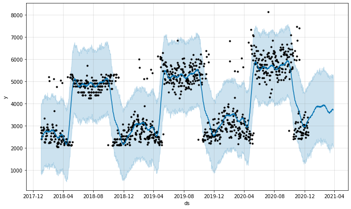
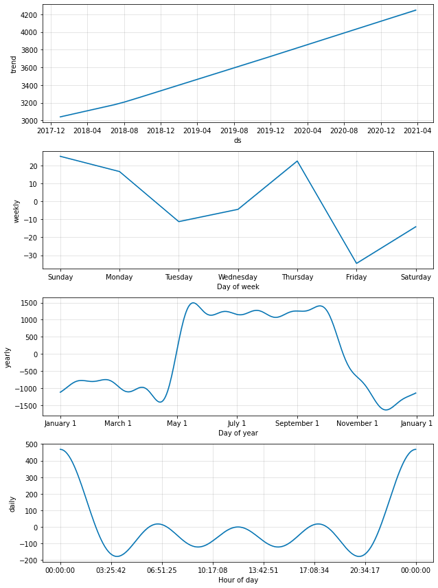

# ForecastRetail
Predicts value of an item in a daily basis and visualize the prediction accordingly. Uses Facebook Prophet for the time series prediction
*Kind of like a better forecast of a small buisness*
 
* Preprocessed data using python library pandas
* Fore cast over a number of time periods using Facebook prophet
* Plotted graphs to represent the data systematically

## GENERAL TREND THAT CAN BE OBSERVED

 

## DECOMPOSED PLOTS

 

